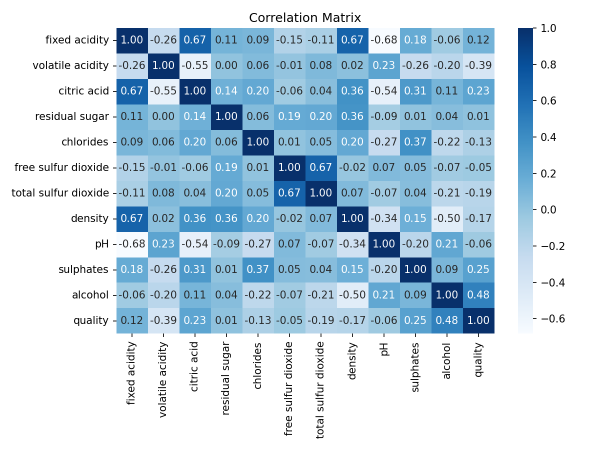
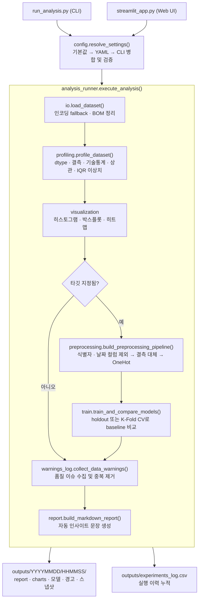

# StatAutoLab

**CSV 한 장을 올리면 EDA · 전처리 · 모델 비교 · 리포트까지 자동으로 끝내주는 데이터 분석 도구**

통계를 처음 다루는 사람도 무엇을 봐야 하는지 고민하지 않도록, 분석 파이프라인 전체를 자동화하고
결과를 사람이 읽을 수 있는 리포트로 만들어 줍니다. 웹 UI(Streamlit)와 CLI 두 가지로 쓸 수 있습니다.


---

## 목차

- [무엇을 해결하나](#무엇을-해결하나)
- [결과 미리보기](#결과-미리보기)
- [빠른 시작](#빠른-시작)
- [프로젝트 구조](#프로젝트-구조)
- [동작 방식](#동작-방식)
- [주요 기능](#주요-기능)
- [CLI 레퍼런스](#cli-레퍼런스)
- [출력물 구조](#출력물-구조)
- [설계 포인트](#설계-포인트)
- [테스트](#테스트)
- [알려진 한계와 다음 단계](#알려진-한계와-다음-단계)

---

## 무엇을 해결하나

데이터 분석 입문자가 매번 반복하는 작업이 있습니다. 결측치 확인, 이상치 확인, 상관관계 확인,
쓰면 안 되는 컬럼 걸러내기, baseline 모델 몇 개 돌려 비교하기, 그리고 그 결과를 정리하기.

StatAutoLab은 이 과정을 **한 번의 실행으로 묶고**, 그 결과를 판단 근거까지 담은 리포트로 내보냅니다.

| 흔한 실수 | StatAutoLab의 대응 |
|:---|:---|
| `customer_id`를 피처로 넣어 학습 | 식별자 패턴 컬럼을 자동 감지·제외하고 경고 기록 |
| 날짜 문자열을 그대로 원핫 인코딩 | 날짜형 컬럼을 감지해 제외하고 경고 기록 |
| 다중공선성을 모른 채 회귀 해석 | VIF와 고상관 변수쌍을 계산해 제거 후보를 제시 |
| 결측 30%인 컬럼을 그냥 사용 | 임계값 초과 컬럼을 경고로 표면화 |
| 클래스 불균형을 무시한 정확도 해석 | 다수 클래스 비율 80% 초과 시 경고 |
| 어떤 설정으로 돌렸는지 기억 못 함 | 실행마다 config 스냅샷과 실험 로그를 누적 저장 |

---

## 결과 미리보기

실제 실행 산출물을 저장소에 포함해 두었습니다. **설치 없이 바로 확인할 수 있습니다.**

### [docs/sample_run/report.md](docs/sample_run/report.md) — 최종 분석 리포트 전문

UCI Wine Quality 데이터(1,599행 × 12열)로 `quality`를 예측한 5-fold 교차검증 실행 결과입니다.

```powershell
python run_analysis.py --input data/real/winequality-red.csv --target quality --eval-method cv --cv-folds 5
```

**리포트가 데이터에서 스스로 뽑아낸 인사이트 (자동 생성 문장)**

> - IQR 기준 이상치 비율이 가장 높은 컬럼은 `residual sugar`이며 비율은 약 9.7%입니다.
> - `quality`와 가장 관련성이 높아 보이는 변수는 `alcohol`이며, 상관계수는 0.476입니다.
> - 현재 baseline 기준 최고 성능 모델은 `RandomForestRegressor`이며 RMSE는 0.574, MAE는 0.414입니다.

**모델 비교 결과**

| model | RMSE | RMSE(std) | MAE | R² |
|:---|---:|---:|---:|---:|
| LinearRegression | 0.6536 | 0.0400 | 0.5070 | 0.3424 |
| **RandomForestRegressor** | **0.5738** | 0.0213 | **0.4136** | **0.4937** |



---

## 빠른 시작

### 1. 설치

```powershell
git clone https://github.com/DandiHaza/statautolab.git
cd statautolab

python -m venv .venv
.\.venv\Scripts\Activate.ps1
python -m pip install --upgrade pip
python -m pip install -r requirements.txt
```

> macOS / Linux는 `source .venv/bin/activate`를 사용하세요.

### 2. 웹 UI로 실행

```powershell
python -m streamlit run streamlit_app.py
```

브라우저에서 `http://localhost:8501`이 열립니다.
CSV/XLSX 업로드 → 타깃·독립변수 선택 → `분석 실행` 순으로 진행합니다.

### 3. CLI로 실행

```powershell
# EDA만 (타깃 없이)
python run_analysis.py --input data/examples/eda_sample.csv

# 회귀
python run_analysis.py --input data/examples/regression_sample.csv --target spending_score

# 분류
python run_analysis.py --input data/examples/classification_sample.csv --target buy

# YAML 설정 파일로
python run_analysis.py --config configs/default.yaml
```

---

## 프로젝트 구조

```text
StatAutoLab/
├── app/                       # 분석 파이프라인 (프레임워크 비의존 순수 로직)
│   ├── io.py                  #   파일 로딩 · 인코딩 fallback
│   ├── config.py              #   설정 병합 · 검증
│   ├── profiling.py           #   EDA 프로파일링
│   ├── preprocessing.py       #   컬럼 선별 · 전처리 파이프라인
│   ├── model_selection.py     #   문제 유형 판별 · baseline 모델 정의
│   ├── train.py               #   학습 · 평가 · best 모델 선정
│   ├── evaluate.py            #   지표 계산
│   ├── regression_insights.py #   OLS · 회귀식 · VIF (회귀 대시보드용)
│   ├── visualization.py       #   차트 생성
│   ├── report.py              #   Markdown/HTML 리포트 생성
│   ├── warnings_log.py        #   데이터 품질 경고 수집
│   ├── experiment.py          #   실행 스냅샷 · 실험 로그
│   └── analysis_runner.py     #   전체 파이프라인 오케스트레이션
│
├── streamlit_app.py           # 웹 UI (app/ 을 호출하는 프레젠테이션 계층)
├── run_analysis.py            # CLI 진입점 (app/ 을 호출하는 프레젠테이션 계층)
│
├── configs/default.yaml       # 실행 설정 예시
├── data/
│   ├── examples/              # 동작 확인용 소형 샘플 4종
│   └── real/                  # 실데이터 (UCI Wine Quality)
├── docs/
│   ├── sample_run/            # 커밋된 실제 실행 결과 (리포트 + 차트)
│   └── UPDATE_LOG.md          # 개발 변경 이력
├── tests/                     # pytest 27개
├── requirements.txt
└── pytest.ini
```

### 예제 데이터

| 파일 | 용도 |
|:---|:---|
| `data/examples/eda_sample.csv` | 타깃 없이 EDA만 실행 |
| `data/examples/classification_sample.csv` | 분류 (`--target buy`) |
| `data/examples/regression_sample.csv` | 회귀 (`--target spending_score`), 식별자 컬럼 자동 제외 확인용 |
| `data/examples/datetime_sample.csv` | 날짜형 컬럼 감지 및 제외 경고 확인용 |
| `data/real/winequality-red.csv` | 실데이터 회귀 (1,599행) |

---

## 동작 방식

CLI와 웹 UI는 모두 **동일한 `app/analysis_runner.execute_analysis()` 하나**를 호출합니다.
UI를 바꿔도 분석 로직은 건드릴 필요가 없고, 두 경로의 결과가 항상 일치합니다.



---

## 주요 기능

### 데이터 로딩
- CSV / XLSX / XLS 지원
- CSV 인코딩 자동 fallback: `utf-8-sig` → `utf-8` → `cp1252` → `latin1`
- BOM·따옴표로 깨진 컬럼명 정규화

### 자동 EDA
- 데이터 개요(행·열·dtype·고유값 수), 결측치 요약
- 수치형 기술통계, 범주형 빈도 요약
- 상관행렬, IQR 기반 이상치 요약(경계값 포함)
- 컬럼별 히스토그램 / 박스플롯, 상관 히트맵

### 변수 자동 선별
독립변수를 지정하지 않으면 다음 규칙을 적용합니다.

- 타깃 컬럼 제외
- `id`, `customer_id`, `user_id`, `*_id`, `*_key`, `uuid` 등 식별자 패턴 컬럼 제외
- 날짜형 컬럼 감지 후 제외 (자동 feature engineering 미지원이므로 경고와 함께)

웹 UI에서는 추가로 **고상관 변수쌍**과 **VIF**를 계산해 제거 후보를 버튼으로 바로 반영할 수 있습니다.

### 모델링

| 문제 유형 | baseline 모델 | 지표 |
|:---|:---|:---|
| 회귀 | `LinearRegression`, `RandomForestRegressor` | RMSE, MAE, R² |
| 분류 | `LogisticRegression`, `RandomForestClassifier` | Accuracy, F1(weighted), ROC-AUC |

- 타깃 dtype 기준 문제 유형 자동 판별 (`--task-type`으로 강제 지정 가능)
- 평가 방식 선택: holdout 또는 K-Fold 교차검증(분류는 StratifiedKFold, 표준편차 함께 보고)
- 전처리 + 모델을 하나의 `Pipeline`으로 묶어 학습 → 데이터 누수 방지
- best 모델을 전체 데이터로 재학습해 `joblib`으로 저장 + metadata JSON 동봉

### 회귀 분석 대시보드 (웹 UI)
- statsmodels OLS summary, 회귀식, 회귀계수표(p-value 포함)
- 잔차 플롯과 초보자용 해석 문구
- VIF·고상관 쌍 기반 다중공선성 점검

### 리포트와 로그
- Markdown / HTML 리포트, 데이터 기반 **자동 인사이트 문장** 생성
- 경고를 `warnings_summary.md`(사람용) + `warnings.json`(기계용) 두 형태로 저장
- `experiments_log.csv`에 실행 이력 누적 (실패한 실행도 기록)

---

## CLI 레퍼런스

```powershell
python run_analysis.py --help
```

| 옵션 | 설명 | 기본값 |
|:---|:---|:---|
| `--input` | 입력 파일 경로 (`.csv`, `.xlsx`, `.xls`) | — |
| `--config` | YAML 설정 파일 경로 (CLI 인자가 우선) | — |
| `--target` | 타깃 컬럼명. 생략하면 EDA만 수행 | `None` |
| `--features` | 독립변수 목록, 쉼표 구분 (`age,income,city`) | 자동 선별 |
| `--output-dir` | 결과 저장 루트 폴더 | `outputs` |
| `--report-format` | `md` 또는 `html` | `md` |
| `--task-type` | `auto` / `regression` / `classification` | `auto` |
| `--eval-method` | `holdout` 또는 `cv` | `holdout` |
| `--cv-folds` | 교차검증 fold 수 (2 이상) | `5` |
| `--test-size` | holdout 검증 비율 (0~1) | `0.2` |
| `--random-state` | 랜덤 시드 | `42` |

설정 우선순위는 **기본값 → YAML(`--config`) → CLI 인자** 순으로 덮어씁니다.

---

## 출력물 구조

```text
outputs/
├── experiments_log.csv              # 전체 실행 이력 (성공/실패 모두)
└── 20260903/170743/                 # 실행 시각별 폴더
    ├── report.md (또는 report.html) # 최종 분석 리포트
    ├── charts/                      # 히스토그램 · 박스플롯 · 상관 히트맵
    ├── config_snapshot.json         # 이 실행에 쓰인 설정 전체 (재현용)
    ├── data_summary.json            # 데이터 요약 (기계 판독용)
    ├── outlier_summary.csv          # IQR 이상치 요약
    ├── preprocessing_summary.md     # 컬럼 분류 및 적용된 전처리 규칙
    ├── model_comparison.csv         # baseline 모델 비교표
    ├── model_summary.md             # 선택된 모델 요약
    ├── best_model.joblib            # 전처리 포함 학습 완료 파이프라인
    ├── model_metadata.json          # 타깃 · 피처 목록 · 성능 지표
    ├── warnings_summary.md          # 경고 (사람용)
    └── warnings.json                # 경고 (기계용)
```

저장된 모델은 전처리가 포함된 파이프라인이라 원본 형태의 DataFrame을 그대로 넣을 수 있습니다.

```python
import joblib
import pandas as pd

model = joblib.load("outputs/20260903/170743/best_model.joblib")
model.predict(pd.read_csv("new_data.csv"))
```

---

## 설계 포인트

**1. UI와 로직의 분리**
`app/`은 Streamlit도 argparse도 import하지 않습니다. CLI와 웹 UI는 동일한 진입 함수를 호출하는
얇은 프레젠테이션 계층일 뿐이라, 새 인터페이스를 붙여도 분석 로직은 그대로 재사용됩니다.

**2. 전처리와 모델을 하나의 Pipeline으로**
imputer와 인코더를 `ColumnTransformer`로 묶고 모델과 함께 `Pipeline`에 넣어 fold마다 fit합니다.
전체 데이터로 먼저 전처리한 뒤 나누는 방식에서 생기는 **데이터 누수를 구조적으로 차단**했습니다.

**3. 경고를 결과물로 취급**
데이터 품질 이슈를 콘솔에 흘려보내지 않고 `WarningRecord` 데이터클래스로 수집해 중복 제거 후
Markdown과 JSON 두 형태로 저장합니다. 사람이 읽는 용도와 후속 자동화 용도를 모두 만족시킵니다.

**4. 실패해도 기록을 남김**
예외가 발생하면 `record_failed_run()`이 경고 로그와 실험 로그를 남긴 뒤 종료합니다.
왜 실패했는지가 실행 이력에 그대로 남습니다.

**5. 재현 가능한 실행**
실행마다 타임스탬프 폴더를 만들고 설정 전체를 `config_snapshot.json`으로 남겨,
어떤 결과든 어떤 설정에서 나왔는지 되짚을 수 있습니다.

**6. 부분 실패에 강한 구조**
baseline 모델 중 하나가 학습에 실패해도 전체 실행을 중단하지 않고, 해당 모델만 경고로 기록한 뒤
나머지 결과로 리포트를 완성합니다. OLS·VIF 계산도 실패 시 대시보드 나머지 영역에 영향을 주지 않습니다.

---

## 테스트

```powershell
python -m pytest
```

27개 테스트가 설정 병합, 파일 로딩, 프로파일링, 전처리, 경고 수집, 실험 로그, CLI 인자 파싱을 검증하고,
`test_smoke.py`는 EDA 경로와 모델링 경로를 **CLI 진입점부터 리포트 생성까지 end-to-end로** 실행합니다.

---

## 알려진 한계와 다음 단계

현재 범위를 명확히 하기 위해 의도적으로 다루지 않은 부분입니다.

- **날짜형 컬럼 feature engineering 없음** — 감지 후 제외만 합니다. 연/월/요일 파생 변수 추출이 다음 과제입니다.
- **하이퍼파라미터 튜닝 없음** — baseline 비교가 목적이라 고정 파라미터를 씁니다.
- **결측 대체는 평균/최빈값 고정** — KNN·반복 대체 등 선택지가 없습니다.
- **범주형은 OneHot 고정** — 고카디널리티 컬럼에서 차원이 급증할 수 있습니다.
- **다중 클래스 ROC-AUC는 OvR 방식** — 지표 해석 시 참고가 필요합니다.

---

## 기술 스택

`Python 3.12` · `pandas` · `scikit-learn` · `statsmodels` · `matplotlib` · `seaborn` · `Streamlit` · `PyYAML` · `joblib` · `pytest`

변경 이력은 [docs/UPDATE_LOG.md](docs/UPDATE_LOG.md)에 정리했습니다.
