# 데이터 분석 리포트: winequality-red.csv

이 리포트는 데이터 개요, 결측치, 수치형 변수 분포, 상관관계, 이상치, 전처리 및 모델 결과를 요약합니다.

## 핵심 인사이트

- 결측치가 거의 없어 기본 데이터 품질은 비교적 안정적으로 보입니다.
- IQR 기준 이상치 비율이 가장 높은 컬럼은 `residual sugar`이며 비율은 약 9.7%입니다.
- `fixed acidity`와 `pH`의 상관계수는 -0.683로, 중간 수준의 선형 관계 가능성이 관찰됩니다.
- `quality`와 가장 관련성이 높아 보이는 변수는 `alcohol`이며, 상관계수는 0.476입니다.
- 현재 baseline 기준 최고 성능 모델은 `RandomForestRegressor`이며 RMSE는 0.574, MAE는 0.414입니다.

## 1. 데이터 개요

데이터는 총 **1599행**, **12열**입니다.

| dtype   |   column_count |
|:--------|---------------:|
| float64 |             11 |
| int64   |              1 |

## 2. 결측치 요약

결측치가 있는 컬럼은 확인되지 않았습니다.

## 3. 이상치 요약

| column               |   outlier_count |   outlier_ratio_pct |
|:---------------------|----------------:|--------------------:|
| residual sugar       |             155 |             9.69356 |
| chlorides            |             112 |             7.00438 |
| sulphates            |              59 |             3.68981 |
| total sulfur dioxide |              55 |             3.43965 |
| fixed acidity        |              49 |             3.06442 |

박스플롯에서 상자 바깥의 점이 IQR 기준 이상치입니다.

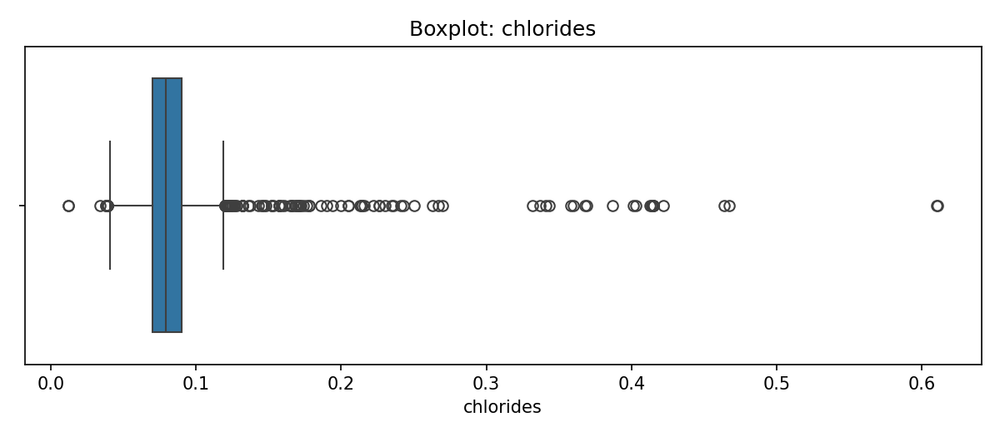

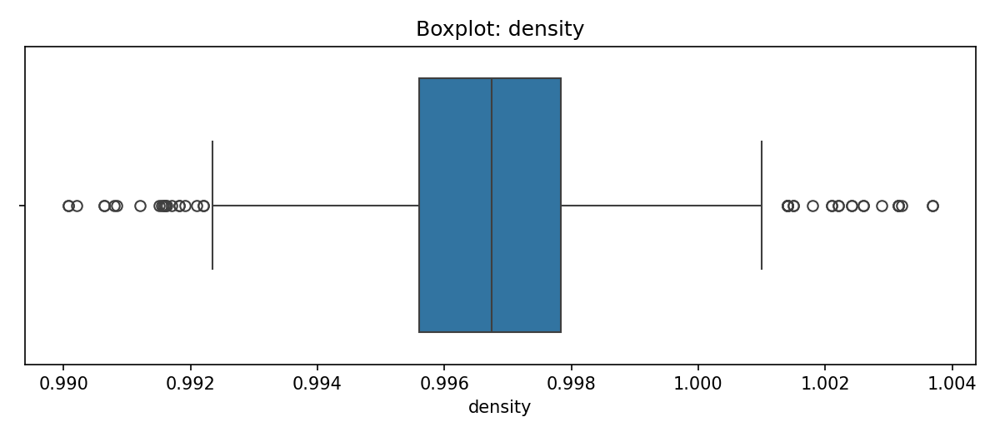
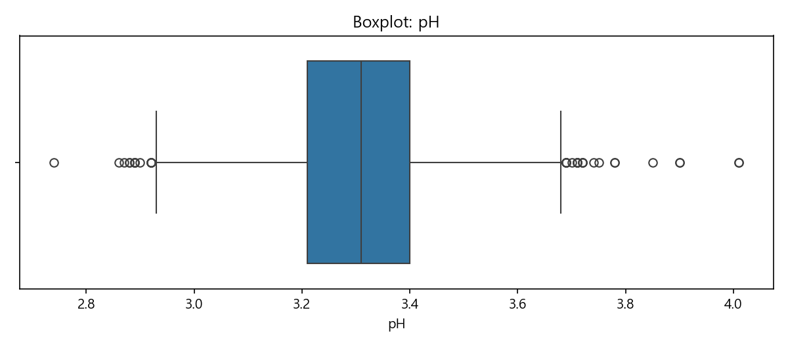
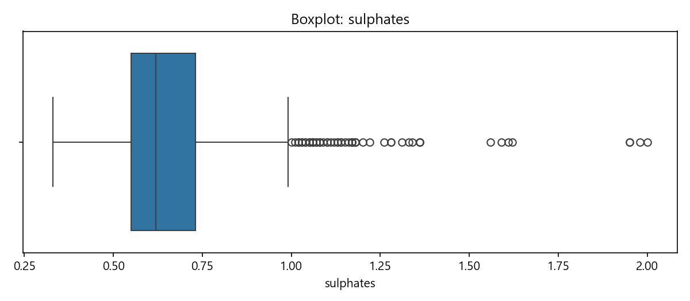
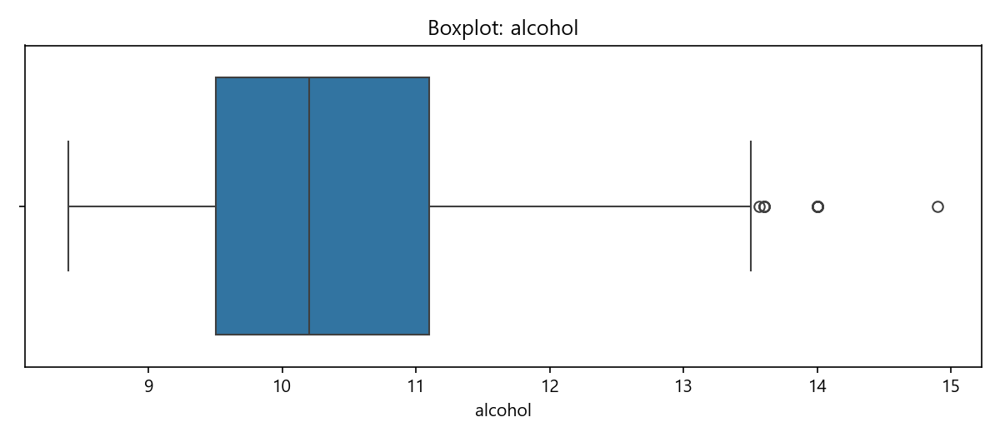
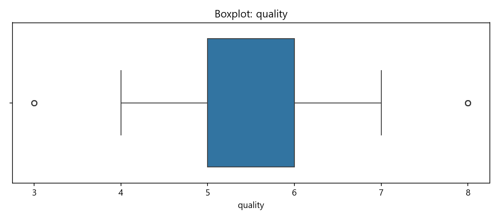

## 4. 수치형 변수 요약

| column               |       mean |         std |     min |       max |
|:---------------------|-----------:|------------:|--------:|----------:|
| fixed acidity        |  8.31964   |  1.7411     | 4.6     |  15.9     |
| volatile acidity     |  0.527821  |  0.17906    | 0.12    |   1.58    |
| citric acid          |  0.270976  |  0.194801   | 0       |   1       |
| residual sugar       |  2.53881   |  1.40993    | 0.9     |  15.5     |
| chlorides            |  0.0874665 |  0.0470653  | 0.012   |   0.611   |
| free sulfur dioxide  | 15.8749    | 10.4602     | 1       |  72       |
| total sulfur dioxide | 46.4678    | 32.8953     | 6       | 289       |
| density              |  0.996747  |  0.00188733 | 0.99007 |   1.00369 |
| pH                   |  3.31111   |  0.154386   | 2.74    |   4.01    |
| sulphates            |  0.658149  |  0.169507   | 0.33    |   2       |

컬럼별 분포입니다. 한쪽으로 치우쳤는지, 봉우리가 여러 개인지 확인해 보세요.

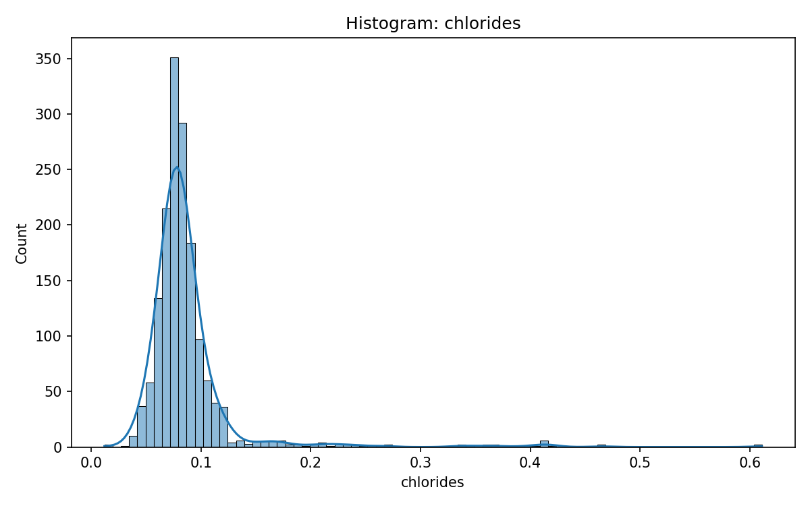

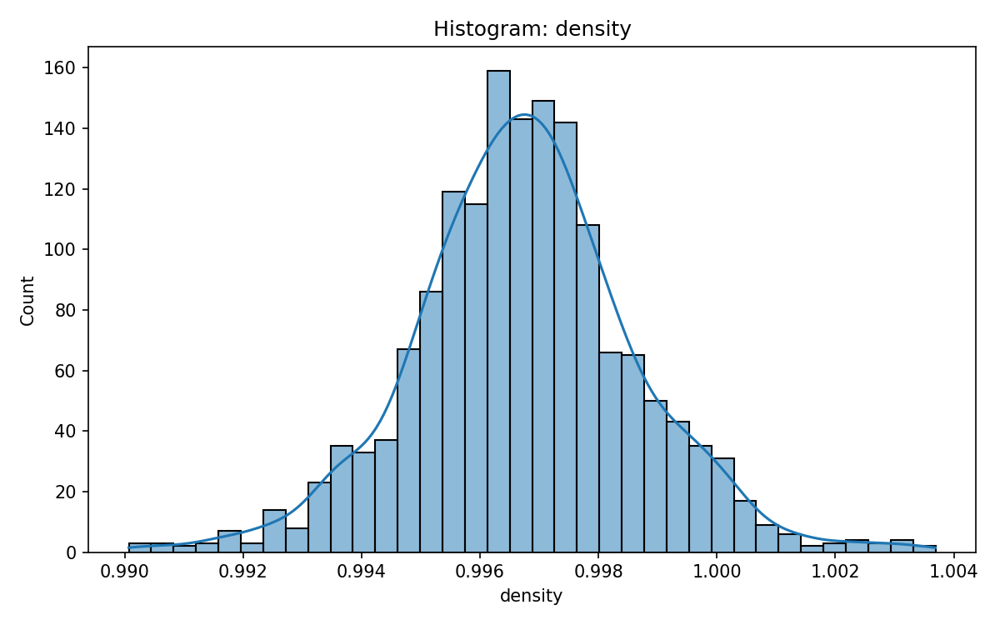
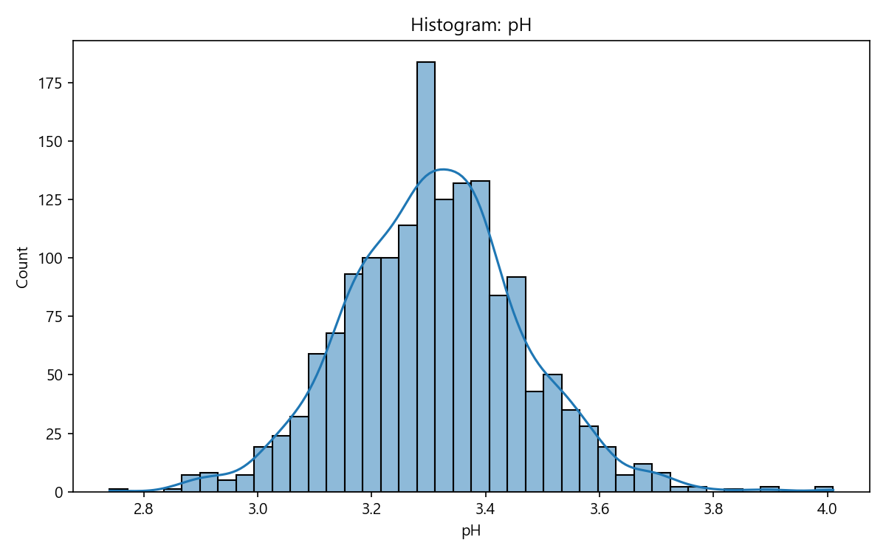
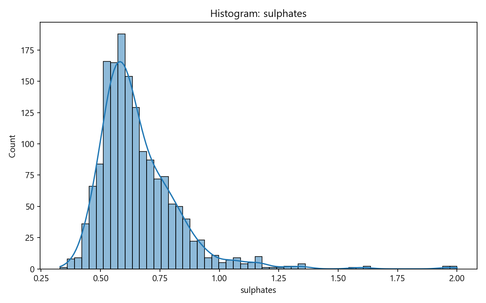
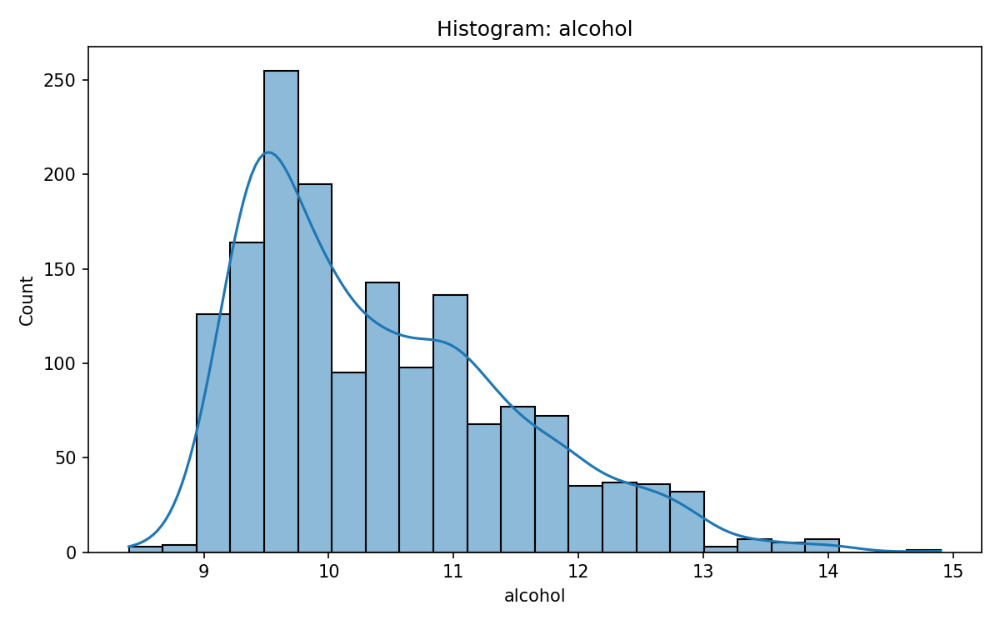
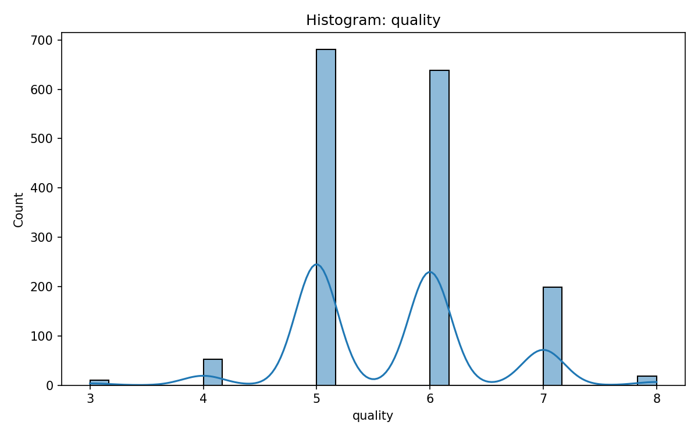

## 5. 상관분석 요약

| feature_a           | feature_b            |   correlation |
|:--------------------|:---------------------|--------------:|
| fixed acidity       | pH                   |     -0.682978 |
| fixed acidity       | citric acid          |      0.671703 |
| fixed acidity       | density              |      0.668047 |
| free sulfur dioxide | total sulfur dioxide |      0.667666 |
| volatile acidity    | citric acid          |     -0.552496 |

## 6. 전처리 요약

- 타깃 컬럼 제외: `quality`
- 선택된 독립변수: fixed acidity, volatile acidity, citric acid, residual sugar, chlorides, free sulfur dioxide, total sulfur dioxide, density, pH, sulphates, alcohol
- 수치형 컬럼: fixed acidity, volatile acidity, citric acid, residual sugar, chlorides, free sulfur dioxide, total sulfur dioxide, density, pH, sulphates, alcohol
- 범주형 컬럼: 없음
- 날짜형 컬럼: 없음
- 수치형 결측치: 평균값 대체
- 범주형 결측치: 최빈값 대체
- 범주형 인코딩: OneHotEncoder

## 7. 모델 결과 요약

- 타깃 컬럼: `quality`
- 문제 유형: **회귀**
- 평가 방식: **cv**
- 교차검증 fold 수: **5**
- 최고 성능 모델: **RandomForestRegressor**
- 하이퍼파라미터 탐색: 미수행 (기본 파라미터)
- best model 저장: `best_model.joblib`
- metadata 저장: `model_metadata.json`

| model                 |     rmse |   rmse_std |      mae |   mae_std |       r2 |    r2_std |
|:----------------------|---------:|-----------:|---------:|----------:|---------:|----------:|
| LinearRegression      | 0.653576 |  0.0400071 | 0.506955 | 0.0368316 | 0.342415 | 0.0641863 |
| RandomForestRegressor | 0.573773 |  0.0213231 | 0.413615 | 0.0204198 | 0.493668 | 0.0274801 |

## 주의사항 및 경고

기록된 주요 경고는 없습니다.
